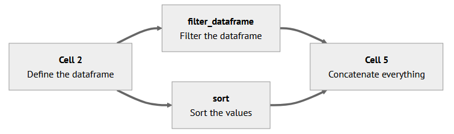
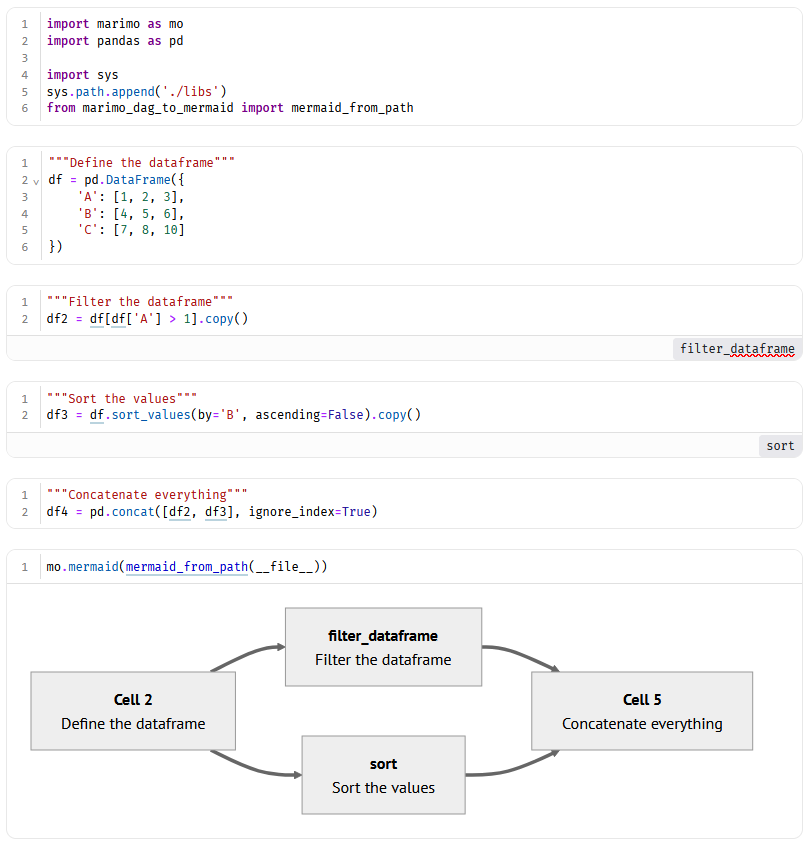

# marimo_graph

Generate Mermaid flowcharts from Marimo notebook Python files.



This project parses Marimo cells from a `.py` notebook file, infers dependencies from function arguments and return values, and produces a Mermaid flowchart representation of the cell DAG. It can also generated graphs directly inside a Marimo notebook.

## HOw it works

- Detects Marimo cells decorated with `@app.cell` (and `@cell` fallback).
- When a cell has been re-named, the name of the cell is used, otherwise incremental numbers are used.
- Doc comments at the top of cells can used to give additional comments.
- Builds dependency edges from:
  - Cell input arguments (what a cell consumes)
  - Returned names (what a cell produces)
- Skips cells that contain import statements to keep the graph focused on notebook logic.
- Removes isolated cells that are not connected to any dependency edge.
- Emits Mermaid flowchart output with frontmatter config.
- Supports optional inline icon metadata in cell docstrings using:
  - `::icon:path/to/icon.svg::`


## Requirements

- Python 3.10+ recommended.
- No external dependencies required for DAG generation.

## Installation

Clone the repository and install with pip.

```bash
git clone <your-repo-url>
cd marimo_graph
pip install .
marimo-dag-to-mermaid --help
```

You can also run the script directly without installing:

```bash
python marimo_dag_to_mermaid.py --help
```

## Usage

### 1) Command Line

From the project root:

```bash
marimo-dag-to-mermaid example/test.py -o example/test_dag.mmd
```

If `-o` is omitted, Mermaid output is printed to stdout:

```bash
marimo-dag-to-mermaid example/test.py
```

Equivalent direct-script form:

```bash
python marimo_dag_to_mermaid.py example/test.py -o example/test_dag.mmd
```

### 2) Inside a Marimo Notebook

The graphs can be rendered directly in the Marimo notebooks:

```python
# Cell 1
import marimo as mo

from marimo_dag_to_mermaid import mermaid_from_path

# Cell 2..X: Do stuff

#Cell Y:
mo.mermaid(mermaid_from_path(__file__))
```

The graph-creating cell has to be run manually, a re-run is not triggered automatically when the notebook is changed.



## API

### `mermaid_from_path(path, title="Marimo DAG") -> str`

Reads a Marimo notebook Python file and returns Mermaid diagram text.

### `parse_cells(source: str) -> list[CellInfo]`

Parses source code into structured cell metadata.

### `to_mermaid(cells, title="Marimo DAG") -> str`

Transforms parsed cells into Mermaid flowchart syntax.

## How Dependency Inference Works

For each detected cell:

- Inputs: function parameters (for example `def _(df): ...`) are treated as dependencies.
- Outputs: return values are parsed from `return ...` expressions.
- Producer mapping: a variable is linked to the latest cell that produced it.
- Edge creation: if a cell input was produced by another cell, an edge is added.

## Notes and Limitations

- Cells with imports are intentionally excluded from graph rendering.
- Only connected cells are rendered.
- Output inference is based on return statements, so cells that only display values without returning them may not contribute outputs.
- If multiple cells overwrite the same returned variable name, the latest producer is used.

## Development

Run script directly while iterating:

```bash
python marimo_dag_to_mermaid.py example/test.py
```

## License

MIT License. See `LICENSE`.
